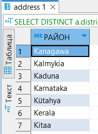
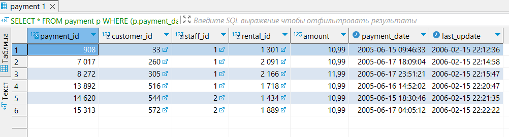
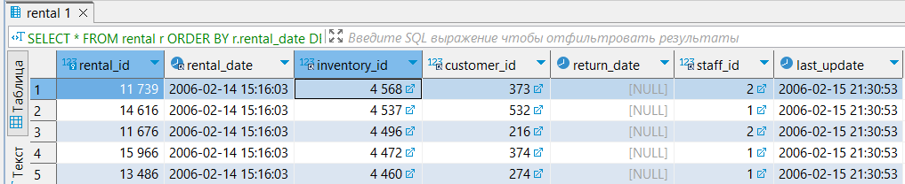
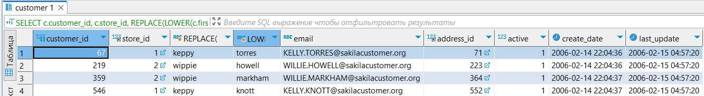
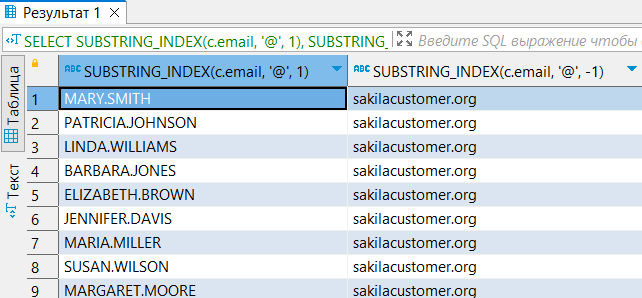
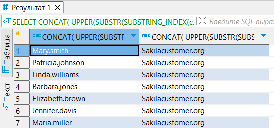

# Домашнее задание к занятию 12.3. «SQL. Часть 1» - Гумлевой Александр

### Задание 1

Получите уникальные названия районов из таблицы с адресами, которые начинаются на “K” и заканчиваются на “a” и не содержат пробелов.

  

```sql
SELECT DISTINCT a.district as 'РАЙОН'
FROM address as a
WHERE district LIKE 'K%a' AND district NOT LIKE 'K% %a';
```

### Задание 2

Получите из таблицы платежей за прокат фильмов информацию по платежам, которые выполнялись в промежуток с 15 июня 2005 года по 18 июня 2005 года **включительно** и стоимость которых превышает 10.00.

  

```sql
SELECT *
FROM payment p
WHERE (p.payment_date BETWEEN '2005-06-15' AND '2005-06-18') AND (p.amount > 10.00);
```

### Задание 3

Получите последние пять аренд фильмов.

  

```sql
SELECT *
FROM rental r
ORDER BY r.rental_date DESC
LIMIT 5;
```

### Задание 4

Одним запросом получите активных покупателей, имена которых Kelly или Willie. 

Сформируйте вывод в результат таким образом:
- все буквы в фамилии и имени из верхнего регистра переведите в нижний регистр,
- замените буквы 'll' в именах на 'pp'.

  

```sql
SELECT c.customer_id, c.store_id, REPLACE(LOWER(c.first_name), 'll', 'pp'), LOWER(c.last_name), c.email, c.address_id , c.active , c.create_date , c.last_update 
FROM customer c
WHERE (c.first_name LIKE 'Kelly' OR c.first_name LIKE 'Willie') AND c.active = 1;
```

### Задание 5*

Выведите Email каждого покупателя, разделив значение Email на две отдельных колонки: в первой колонке должно быть значение, указанное до @, во второй — значение, указанное после @.

  

```sql
SELECT SUBSTRING_INDEX(c.email, '@', 1), SUBSTRING_INDEX(c.email, '@', -1)
FROM customer c;
```

### Задание 6*

Доработайте запрос из предыдущего задания, скорректируйте значения в новых колонках: первая буква должна быть заглавной, остальные — строчными.

  

```sql
SELECT CONCAT( UPPER(SUBSTR(SUBSTRING_INDEX(c.email, '@', 1),1,1)), LOWER(SUBSTR(SUBSTRING_INDEX(c.email, '@', 1),2))), 
	   CONCAT( UPPER(SUBSTR(SUBSTRING_INDEX(c.email, '@', -1),1,1)), LOWER(SUBSTR(SUBSTRING_INDEX(c.email, '@', -1),2)))
FROM customer c;
```